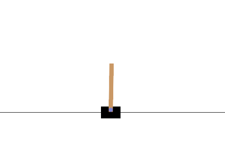

# Deep-RL-Cart-Pole
Solving the classic Cart Pole problem using Deep Reinforcement Learning (DQN)

## The Cart Pole Environment
The Cart Pole problem is a classic controls and robotics problem where an agent a cart allowed to move laterally tries to balance a pole upright on a single pivot point, and typically solved using PID control. Here we are solving the CartPole-v1 (Gymnasium library) environment using Deep Q-Learning, a fundamental Deep Reinforcement Learning approach. The agent learns to balance the pole on the cart by taking discrete actions to move left or right based on continuous observations from the environment. 



The object is simple: prevent the pole from falling over by moving the cart left or right. 
The environment ends when the pole falls past a certain angle (-24&deg; to +24&deg;), the cart strays too far from the center (beyond -4.8 and 4.8), or after 500 steps in one episode (also the maximum possible reward per episode). Each successful step gives a +1 reward to the agent if the pole is still upright, and the episode terminates if the above conditions fail. 

The state space is continuous and represented by 4 variables: the cart position, cart velocity, pole angle, and pole angular velocity (both velocities have no bounds in this environment). The action space is discrete: move the cart left or right. 

## Deep Q-Learning (DQN)

Instead of using a traditional Q-table (infeasible with continuous state spaces), we use a **neural network** to approximate the Q-values for each action.

### How It Works:
- Two networks are used:
  - **Online Network:** Learns and updates Q-values via backpropagation.
  - **Target Network:** Provides stable Q-value targets and is updated less frequently.
- The agent learns to predict Q-values for each action given a state and chooses actions using an **epsilon-greedy** policy.
- A **Replay Buffer** stores past experiences and samples mini-batches to break temporal correlation.

The agent during the training process, learning as it progresses:


A common problem encountered with this is that a standard DQN can overestimate action values during the training process. The fix is using the 'double DQN' method that reduces this by decoupling the action selection and evaluation between the two networks, leading to more stable and reliable learning.

The fully trained agent solving a randomly initialized environment:


# Further Improvements: Stability and Centering

We can go a step further with the goal of having the agent solving the problem while as still as possible in the center of the screen. To do this, a custom reward function was made to accomodate extra penalties for movement in angle and deviation from the center. 

The following code was added to the training loop, and the agent then re-trained:

```bash
########### Improvement to base functionality. Comment this out to achieve first part of ReadMe
# Custom reward to favor centered position and upright pole
x, x_dot, theta, theta_dot = next_state
reward = 1.0
reward -= 2.0 * (abs(x) / 2.4)          # strongly penalize distance from center
reward -= 1.5 * (abs(theta) / 0.2095)   # strongly penalize pole angle
reward -= 0.1 * abs(x_dot)              # penalize movement
reward -= 0.1 * abs(theta_dot)          # penalize swinging
                
reward = max(reward, -1.0)  # prevent overly negative reward
                
if terminated:
    reward -= 2.0                       # extra penalty if episode ends early
############
```

This resulting test video below shows the agent solving this in a much more stable manner with minimal deviations.


Not: the video was rendered and then added to the dir. Manually change video_path to prevent over-writing the previous attempts/videos.

# Installation

This program was made using Python 3.10.16 in a Conda environment:
```bash
conda create --name RL_Taxi python=3.10
```

Requires PyTorch with CUDA. To check if you've installed it correctly, printing this should return True:
```bash
torch.cuda.is_available()
```

Use pip and requirements.txt to install the required packages:
```bash
pip install -r requirements.txt
```

# Running the Code

Run the python code to train the model:
```bash
python3 cartpole.py --mode train
```

Then, run this to test the model:
```bash
python3 cartpole.py --mode test
```

This saves the training and test results as videos, along with the training curve for rewards over time. 
